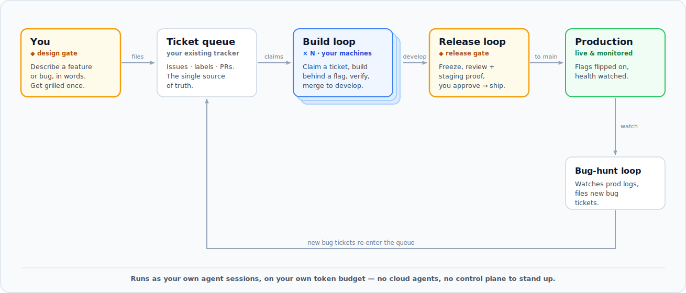

# autodev

**Describe what you want your app to do — autodev automates the rest of your dev flow.**
No cloud agents, no control plane to stand up.

## Get started

**Step 1 — paste this into your coding agent** (Claude Code, Cursor, Codex, …):

```text
Set up autodev in this project. If the autodev-setup skill isn't installed yet,
install it by running `npx skills add devgoldm/autodev`. Then run the
autodev-setup skill: interview me, pick the presets, and scaffold the
vision-driven workflow. I'll answer your setup questions.
```

**Step 2 — answer its questions.** It interviews you, picks the presets for your stack/tracker/agent, and scaffolds everything. When it's done, you're running.

**Step 3 *(optional)* — add more build loops.** Want it to build faster? Add build loops that run in parallel — on **another machine**, or even **several on one machine**. To add a machine: **check out your repo** on it, then paste this (your primary machine keeps release + monitoring):

```text
Set this machine up as an additional autodev BUILD worker for this repo — not the
primary. If the autodev-setup skill isn't installed, run
`npx skills add devgoldm/autodev`. Read .claude/autodev/config.json and
.claude/autodev/ORCHESTRATION.md, then register ONLY the autodev-build loop, with a
unique worker suffix and its own dev port, on a staggered schedule (a different cron
minute from the other loops). Do NOT add the release or bug-hunt loops — those stay
on the primary. Install dependencies and set up the gitignored env the build loop
needs (the flag-management token if this project manages flags via an API, plus any
local secrets the dev server needs to run); ask me for any values you don't have.
```

To add a second loop on a machine that's *already* a builder, paste the same prompt there — it registers another loop with a fresh worker suffix + dev port. Each loop builds in parallel on its own token budget; an atomic per-ticket claim keeps them from colliding. Default is one loop per machine, which keeps token spend predictable. More detail in *Scale across machines* below.

## How it works



You only ever do two things: **describe** what you want (a feature or a bug, in plain language), and **approve** a release (one signal on the release PR). Everything between is your own coding agent, running on a loop:

1. **Front door — you describe it.** You talk to your agent; it grills you on the design, writes a spec (a PRD), and files a **ticket** in the tracker you already use. This is the one place you make decisions.
2. **Build loop — it builds.** A scheduled agent run claims the top ticket, builds it behind a feature flag, verifies it (tests + actually running the app), and merges to `develop` → staging. Run this loop on as many machines as you like; they coordinate purely through the ticket queue, so they never collide.
3. **Release loop — you approve, it ships.** Once a day a single agent run freezes a release, reviews it, gathers authenticated staging proof, and pings you. You approve; it merges to production and flips the flags on.
4. **Bug-hunt loop — it watches.** It reads production logs and files new bug tickets straight back into the queue, closing the loop.

The whole thing coordinates through **ordinary issues, labels, and PRs** — no central coordinator, no dashboard, no metered compute. It's just your agent, your token budget, and the tracker you already have.

---

<details>
<summary><b>What is this, and why?</b></summary>

Most "autonomous agent" setups push you toward a hosted control plane: cloud agents you rent, a separate dashboard to babysit, infrastructure to stand up, and a metered bill that grows with the work. That's a lot of overhead for a small team or a solo developer who just wants their coding agent to keep shipping.

Autodev takes the opposite approach. It turns a queue of tickets into work your **own** agents pick up and pool down — running locally, on the token budget you're already paying for, against the **standard ticketing system you're probably already using** (GitHub Issues by default). The loop is just a few scheduled runs of your own agent — driven by whatever automation your agent already has (Claude Code scheduled tasks, Cursor automations, plain `cron`, …) — coordinating through ordinary issues, labels, and PRs.

That means:

- **No cloud agents required.** Everything runs as your own agent sessions; you stay inside your own token budget instead of renting metered compute.
- **No control plane, no special infrastructure.** Coordination happens through your repo's issues/labels/PRs — things you already have. Want more throughput? Point another machine's loop at the same tickets; an atomic per-issue claim keeps them from colliding.
- **Install-and-go.** Drop in the skill, point it at a ticketing system, and you're running. Deliberately small enough for an individual or a small company to operate without a platform team.
- **Use what you already have.** Your tracker, your git host, your stack, your model — all swappable presets, none of them assumed.

After setup, the owner's whole job is to write and refine a `VISION.md` and answer the occasional design question. Agent sessions propose features, build them behind feature flags, verify them, ship them through a reviewed release gate, monitor production, and keep the codebase clean. The two human gates are **feature design** (a grilling conversation) and **release approval** (one signal on the release PR). Everything else runs unattended.

</details>

<details>
<summary><b>What you get</b></summary>

A one-time setup pass scaffolds a project with:

- **`VISION.md`** — the owner's single source of intent.
- **Five project commands** (installed as project skills): `/vision`, `/build-next`, `/release`, `/bug-hunt`, `/refactor-pass`.
- **Gitflow branching** (`feature/* → develop → release/<version> → main`) with a frozen release branch, every feature gated behind a **feature flag**, and PR-only movement between branches.
- **Two-tier verification** — local dogfooding before merge, authenticated staging evidence before release — so nothing reaches production un-exercised.
- **An optional autonomous loop**: three scheduled tasks (build / release / bug-hunt) that carry an idea from "pushed" all the way to "shipped and monitored", contacting the owner only at the release gate.
- **Living docs**: `CONTEXT.md`, PRDs under `docs/prds/`, and ADRs under `docs/adr/`, kept current so any cold agent session can pick the project up.

</details>

<details>
<summary><b>Scale across machines (optional)</b></summary>

The build loop is **horizontally scalable** — the cheapest way to ship faster is to add build loops that build in parallel. There's **no central coordinator and no global lock**: loops coordinate purely through the ticket queue, keyed on a per-loop **worker id** (hostname + suffix) — so you can run several on **one** machine as well as across many. Default is **one loop per machine** (predictable token spend); add more whenever you want.

- **Add a machine** — two steps: (1) **check out your repo** on it, (2) **paste the build-loop prompt** from Step 3.
- **Add a loop to an existing machine** — paste the same prompt there; it registers another loop with a fresh worker suffix + dev port.

Either way the prompt registers **only** the build loop (`autodev-build`) — staggered schedule, unique worker suffix, own dev port — and leaves the **release** and **bug-hunt** loops on the **primary** machine (it owns production monitoring and the approval gate).

An **atomic per-ticket claim** guarantees no two loops ever build the same ticket. Each loop is another worker pulling from the same queue on its own token budget; removing one is just deleting its build task (in-flight work is auto-reclaimed). Full procedure: [`SKILL.md`](autodev-setup/SKILL.md) step 7, claim protocol in [`githost-github.md`](autodev-setup/presets/githost-github.md).

</details>

<details>
<summary><b>Presets — how it stays universal</b></summary>

It is **stack-, git-host-, and runtime-neutral**. The neutral core refers to each choice by role; a preset fills it in. Pick one per axis at setup (recorded in `config.json`):

| Axis | Role | Reference preset | Generic option |
|---|---|---|---|
| **Stack** | what the app is built/deployed on | [`stack-cloudflare.md`](autodev-setup/presets/stack-cloudflare.md) (Workers + Hono + Vite/React + flags) | [`stack-generic.md`](autodev-setup/presets/stack-generic.md) — fill-in template for any stack |
| **Git host** | repo, work tracker, PRs | [`githost-github.md`](autodev-setup/presets/githost-github.md) (GitHub via `gh`) | adapt the adapter to GitLab/Gitea/… |
| **Loop runtime** | what runs the autonomous loops | [`runtime-claude-code.md`](autodev-setup/presets/runtime-claude-code.md) (Claude Code scheduled tasks) — same pattern fits Cursor automations, Codex, or any agent with scheduling | [`runtime-cron-ci.md`](autodev-setup/presets/runtime-cron-ci.md) (server cron / CI) |

Existing projects always take the generic stack path: autodev **detects and records** the existing stack, flag mechanism, test setup, and deploy pipeline — it never migrates or restructures your code.

</details>

<details>
<summary><b>Install options & layout</b></summary>

autodev is a portable [`SKILL.md`](https://skills.sh) skill, so it installs into 18+ coding agents (Claude Code, Cursor, Cline, Copilot, …) with the skills CLI:

```bash
npx skills add devgoldm/autodev --skill autodev-setup
```

Or install it by hand — copy the skill directory into your agent's skills location, e.g. for Claude Code:

```bash
cp -R autodev-setup ~/.claude/skills/autodev-setup
```

Then ask your agent to **"set up autodev"** (or invoke the skill). See [`autodev-setup/SKILL.md`](autodev-setup/SKILL.md) for the full process and [`autodev-setup/METHODOLOGY.md`](autodev-setup/METHODOLOGY.md) for the model it follows.

```
autodev-setup/
  SKILL.md              The setup process (the skill your agent runs)
  METHODOLOGY.md        The operating model — stack/host/runtime-neutral
  SETUP-REFERENCE.md    Universal setup details + the config.json schema
  presets/              Swappable stack / git-host / runtime presets
  templates/            Files copied into the target project:
    VISION.md  BACKLOG.md  PRD-FORMAT.md  ORCHESTRATION.md  config.json
    vision/ build-next/ release/ bug-hunt/ refactor-pass/   (the five commands)
    grill/                (autodev's bundled grilling skill, used by /vision)
    scheduled-tasks/    (the three autonomous loops)
```

**Self-contained:** everything the commands need ships inside the project — including autodev's own bundled **`grill`** skill — so a project behaves identically for anyone who clones it. The only genuinely external dependency is a browser-automation tool for the verification tiers (a tool, not a skill).

</details>

## License

[MIT](LICENSE) © devgoldm.
